
其實pre-exam也寫在這裡了
因為兩個沒差多少



## <h1>前言</h1>
這次能打到前五真的覺得很不可思議，感覺今年題目有比較難  
<del>雖然我也沒有打過之前的比賽就對了</del>  
這次能打到第五名首先要特別感謝<del>努力的自己</del> ，還有要特別感謝成大資安社還有B33F 50μP戰隊，提供了許多學習資源讓我學習
，不過這次能打到那麼高真的覺得自己只是單純運氣好，比賽的時候想到比較多奇怪的方法，<del>很多題還都是被我硬搓出來的</del>  
而且賽後發現很多本來名次在我後面的，在pre-exam的名次都超過我了🛐

建議想看比較正規解的人可以去看看別人的write up，我的真的都比較偏通靈向

廢話夠多了，再來就進入到WriteUp的部分了


## <h1>Scoreboard</h1>
先丟上自己的記分板還有賽後超長的記分板


[我是MFCTF完整記分板](https://betan423.github.io/posts/seondpost/images/long_scoreboard.png)

[我是pre-exam完整記分板](https://betan423.github.io/posts/seondpost/images/pre-exam.ais3.org_scoreboard.png)


## <h1>Misc</h1>
## Welcome
這次的Welcome沒有整活，單純點開題目描述就有了

flag:AIS3{Welc0me_to_AIS3_PreExam_2o24!}

<del>好歹也把pre-exam改成MFCTF吧</del>
<br></br>

## Quantum Nim Heist

這題是賽後在pre-exam才解出來的



這題當初在MFCTF的時候是想說可能要先去破解他hash加密的部分

然後自己找出把1加密後的結果再拿去讀檔

所以MFCTF的時候想很久也沒有想出來該怎麼做

結果賽後在pre-exam的時候無聊去亂試意外就找到破解的地方了

<h2>solve:</h2>

如果一開始遊玩時亂輸入的話會顯示錯誤，因此就先正常進行遊戲動個幾步，後面直接按enter就會發現沒有報錯，而且對手也會動下一步

因此再來就是等對手動到剩下最後一排的時候再去收割就好了

  
  
  



flag:AIS3{Ar3_y0u_a_N1m_ma57er_0r_a_Crypt0_ma57er?} 
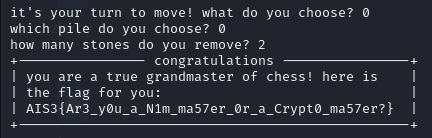
<br></br>


## <h1>Reverse</h1>
## The Long Print

先透過IDA查看反編譯後的代碼，主要可以發現在輸出的部分會重複執行sleep，因此無法直接透過執行來查看flag
，並且可以看到flag應該是存在v4也就是rsp的部分

這邊再特別解釋一下，因為從上面反編譯後可以看到輸出後會再做V4>\>=8的動作
因此這邊就是每次察看rsp的末兩位就好了


我一開始是透過gdb來在sleep的地方下斷點，然後直接jump到下一行，結果發現最後拚出來的flag怪怪的

<del>其實這邊這個方法也可以 只是我當時看錯東西</del>

所以又去嘗試透過IDA先找到sleep的地方換成16進制檔案時在哪，再透過010Editor把那部分改成90，也就是不進行任何動作(這部分等等的火拳也會用到，會再詳細介紹)
<h2>solve:</h2>

兩個方法其實後面要做的事情都差不多，都一樣是丟到gdb裡面，然後再printf的地方下斷點，並查看當時rsp的質，最後再轉成ASCII字元就好了
所以再來就一樣慢慢把flag搓出來

```
$rsp 的質: 
0x3353494100000000 
0x756f597b00000000 
0x6572615f00000000 
0x6568745f00000000 
0x73616d5f00000000 
0x5f72657400000000 
0x745f666f00000000 
0x5f656d6900000000 
0x616e616d00000000 
0x656d656700000000 
0x2121746e00000000 
0x7d3f212100000000 
```
flag: AIS3{You_are_the_master_of_time_management!!!!?}


<br></br>

## 火拳のエース

特別感謝Kazma在讀書會上分享angr這個工具
這題是透過angr來快速解出來的
[Kazma的angr教學](https://kazma.tw/2024/04/30/Angr-CTF-Writeups/)

<del>也沒有到秒解 還是想了很久</del>

<h2>solve:</h2>
一樣都先透過IDA查看反編譯後的代碼，發現跟之前自己練習angr官方Lab006使用到的觀念都差不多  
主要都是把數據存在動態內存再去做混淆
<br></br>


題目:

lab006:

所以這邊直接偷Lab006的解來稍作修改
```py
import angr
import claripy
import sys
def main(argv):
  path_to_binary = argv[1]
  project = angr.Project(path_to_binary)
  start_address = 0x08049661
  initial_state = project.factory.blank_state(
    addr=start_address,
    add_options = { angr.options.SYMBOL_FILL_UNCONSTRAINED_MEMORY,
                    angr.options.SYMBOL_FILL_UNCONSTRAINED_REGISTERS}
  )
  password0 = claripy.BVS('password0', 64)
  password1 = claripy.BVS('password1', 64)
  password2 = claripy.BVS('password2', 64)
  password3 = claripy.BVS('password3', 64)
  fake_heap_address0 = 0xffffc93c
  pointer_to_malloc_memory_address0 = 0x090FB2D4
  initial_state.memory.store(pointer_to_malloc_memory_address0, fake_heap_address0, endness=project.arch.memory_endness)
  fake_heap_address1 = 0xffffc94c
  pointer_to_malloc_memory_address1 = 0x090FB2D8
  initial_state.memory.store(pointer_to_malloc_memory_address1, fake_heap_address1, endness=project.arch.memory_endness)
  fake_heap_address2 = 0xffffc95c
  pointer_to_malloc_memory_address2 = 0x090FB2DC
  initial_state.memory.store(pointer_to_malloc_memory_address2, fake_heap_address2, endness=project.arch.memory_endness)
  fake_heap_address3 = 0xffffc96c
  pointer_to_malloc_memory_address3 = 0x090FB2E0
  initial_state.memory.store(pointer_to_malloc_memory_address3, fake_heap_address3, endness=project.arch.memory_endness)
  initial_state.memory.store(fake_heap_address0, password0)
  initial_state.memory.store(fake_heap_address1, password1)
  initial_state.memory.store(fake_heap_address2, password2)
  initial_state.memory.store(fake_heap_address3, password3)
  simulation = project.factory.simgr(initial_state)
  def is_successful(state):
    stdout_output = state.posix.dumps(sys.stdout.fileno())
    return b'Yes! I remember now, this is it!' in stdout_output
  def should_abort(state):
    stdout_output = state.posix.dumps(sys.stdout.fileno())
    return b'It feels slightly wrong, but almost correct...' in stdout_output
  simulation.explore(find=is_successful, avoid=should_abort)
  if simulation.found:
    solution_state = simulation.found[0]
    solution0 = solution_state.solver.eval(password0,cast_to=bytes).decode()
    solution1 = solution_state.solver.eval(password1,cast_to=bytes).decode()
    solution2 = solution_state.solver.eval(password2,cast_to=bytes).decode()
    solution3 = solution_state.solver.eval(password3,cast_to=bytes).decode()        
    print (solution0,solution1,solution2,solution3)
  else:
    raise Exception('Could not find the solution')
if __name__ == '__main__':
  main(sys.argv)
```
這邊不特別解釋angr的代碼在做什麼

接著透過剛剛LongPrint提到的，透過16進制編輯器先把print_flag的部分刪掉，因為這邊我們直接透過strings就可以看到前半部分了
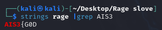
具體刪除的方法是先透過IDA在欲刪除的部分下斷點，然後開啟debug模式，接著到設定將Number of opcode bytes設成6，接著切回去就可以看到該段位於十六進制檔案中的何處了


接著就拿腳本去跑一次修改過後的檔案，發現居然錯了
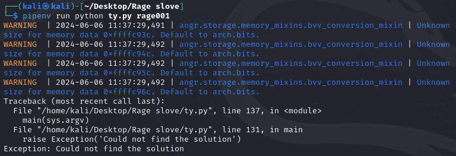

後面想說那不如乾脆把與lab不同的地方(進行xor的部分)也乾脆先刪掉好了，因此重複上述操作，再去跑一次腳本，發現這次就有順利出現結果了！
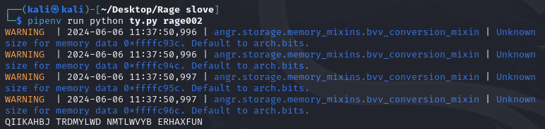

那接著就是把得到的質丟回去還有xor的檔案，接著透過gdb在進行xor後下斷點，查看xor後的質是多少
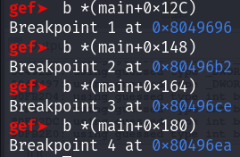

那最後flag也是順利被我搓出來了
<del>這題大概是我這次最正規的解法了</del>
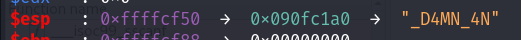
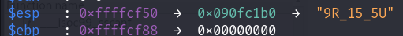
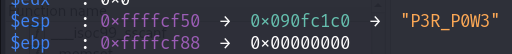
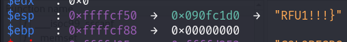

flag:AIS3{G0D_D4MN_4N9R_15_5UP3R_P0W3RFU1!!!}
<br></br>

## <h1>Web</h1>
## Evil Calculator

<h2>solve:</h2>
連進去發現是一個計算機，就很普通的計算機

接著透過burp suite攔截發送1+1過去時的封包並送到Repeater查看
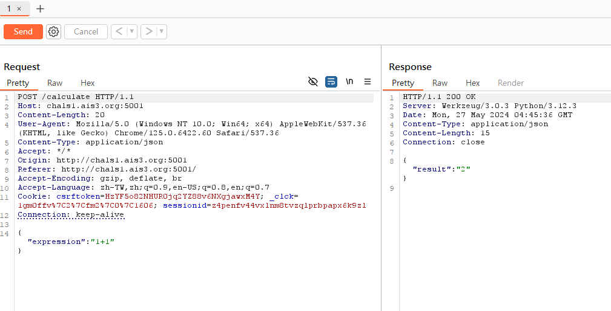
接著就嘗試修改1+1的部分，我先是嘗試看看能不能單純輸出字元，或是符號之類的

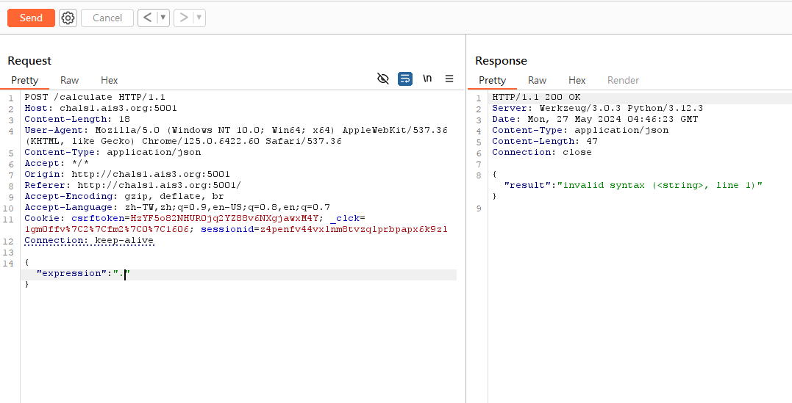
發現好像不能直接輸出，那接著猜測是不是只能數字，因此這邊使用簡單的len來查看，發現可以正常輸出，因此推測只要是轉成數字輸出後就可以
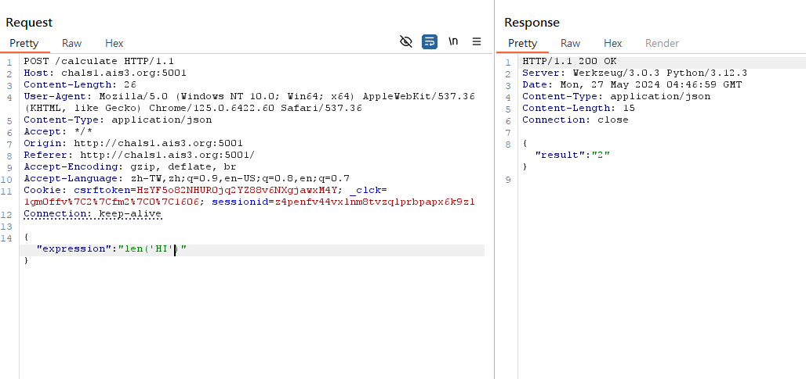
接著就根據題目給的檔案，知道了flag是在前一個目錄裡面，因此就嘗試結合len、read、跟Path Traversal去讀看看，發現也可以正常執行，並且知道了flag的長度為31
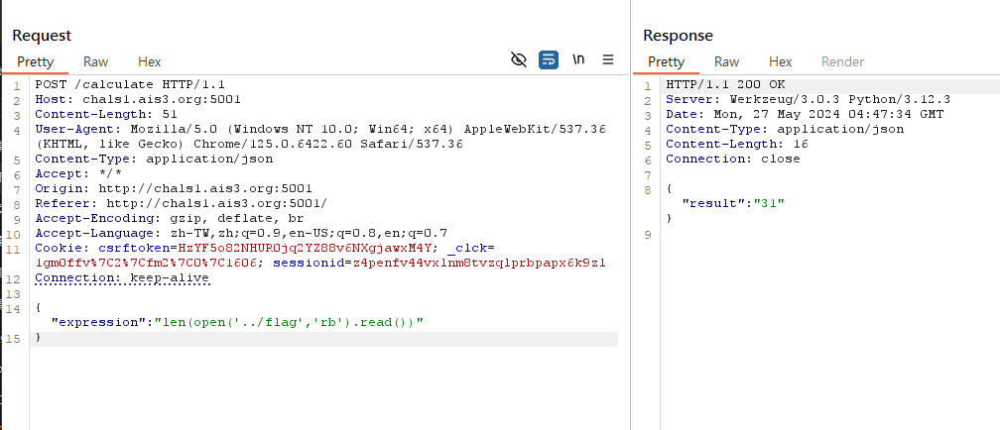
再來我的想法是，一個一個讀取flag的字元，因此一樣使用read只是將len改成ord來查看該字元換成ASCII為多少，但發現會報錯

這邊直接把報錯貼到google去看，了解原來是因為直接read後就已經是數字了，不需要再透過ord去轉
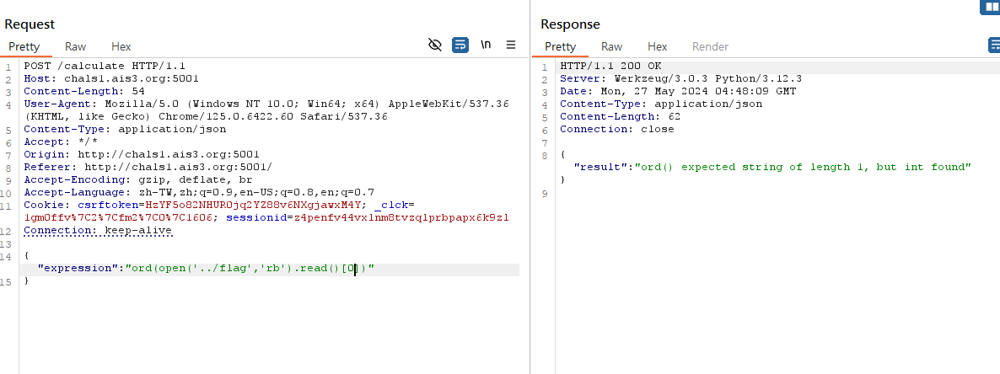
因此最後直接就把ord去掉，再次察看就會發現有正常輸出了！

<del>然後就重複這個操作31次 flag就被我搓出來了呢</del>
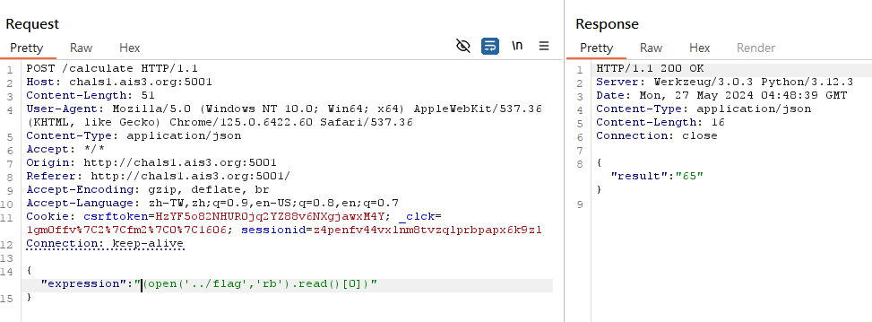

flag:AIS3{7RiANG13_5NAK3_I5_50_3Vi1}


<br></br>

## <h1>Crypto</h1>
## babyRSA

<del>這題也是被我硬搓出來的 我對不起大家</del>

<h2>solve:</h2>
這邊先查看原代碼，可以發現它應該是對flag的每個字元去做個別加密的，因此最後輸出結果才會有那麼多

這邊我想了很久，最後決定！


<del>對string.printable全部做一次加密 然後慢慢把flag對照搓出來 我的方法真的很笨 自己都看不下去的那種</del>

```py
import string
def encrypt(pk, plaintext):
    key, n = pk
    cipher = [pow(ord(char), key, n) for char in plaintext]
    return cipher


public=(64917055846592305247490566318353366999709874684278480849508851204751189365198819392860386504785643859122396657301225094708026391204100352682992979425763157452255909781003406602228716107905797084217189131716198785709124050278116966890968003294485934472496151582084561439957513571043497031319413889856520421733, 115676743153063753482251273007095369919613374531038288437295760314264647231038870203981488393720761532040569270340726478402172283300622527884543078194060647393394510524980830171230330673500741683492143805583694395504141751460090539868114454005046898551218623342425465650881666420408703144859108346202894384649)
flag=string.printable
print(flag)
encrypted_msg = encrypt(public, flag)
for i in range(len(flag)):
    print(flag[i],"=",encrypted_msg[i])
```
我是直接在記事本裡面慢慢用搜尋跟取代把flag搓出來啦，因為那個時候比賽快結束了，也懶得去想程式碼要怎麼寫，所以這邊就直接藉助了工人智慧
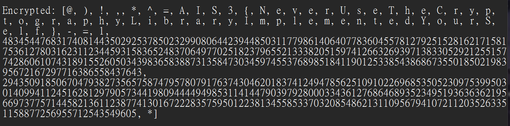

<del>而且flag檔案的第一碼還不是A 害我當初困惑超久 所以後面才決定直接把全部都硬搓出來</del>

flag:AIS3{NeverUseTheCryptographyLibraryImplementedYourSelf}


<br></br>
好欸終於寫完了

然後如果發現我上述有錯誤的地方 都歡迎私訊我提醒我改一下

## <h1>相關問題</h1>

這邊會比較偏我當初行前自己有疑惑的點，算是半個指引吧


首先是交通的問題，這次舉辦的地點在救國團劍潭青年活動中心-集賢廳 (台北市中山北路四段16號)

我自己是騎車過去啦，當初一直在想到底有沒有車位，後來其實發現在正門入口就有免費停車場了，而且還滿空的，因此大家可以放心騎車去了
<br></br>

再來是題目數量的部分，這次題目好像有比較多，以往好像都是各類型抓兩題，但這次是變成三題，不確定以後會不會也都是三題

題目總覽
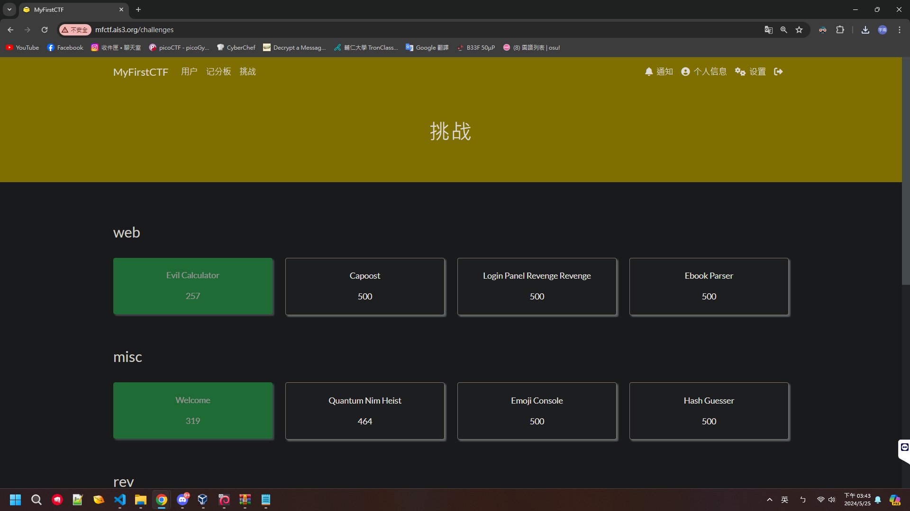
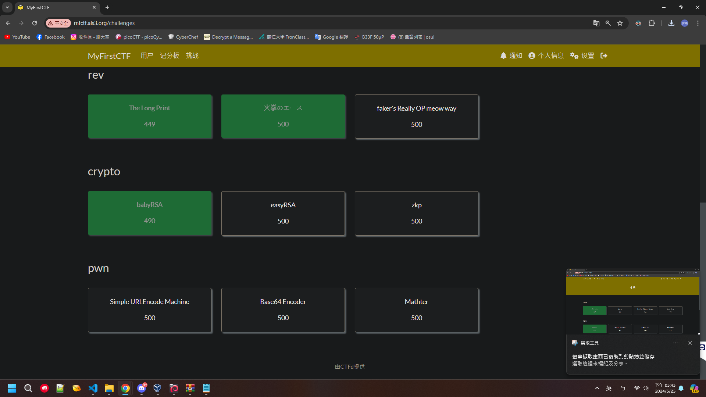

 