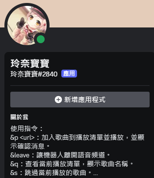
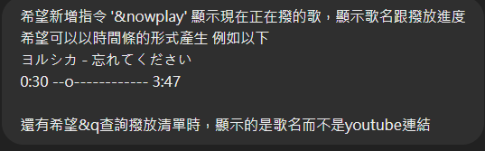

<br></br>


因為最近dc很多音樂機器人都壞掉  
一氣之下就直接<del>透過chatGPT</del>寫一個出來了



## <h2>前言</h2>
其實真的沒啥技術含量，因為代碼真的都是叫GPT幫我搓出來的  
但還是想說丟上來好了，畢竟在自己本地架機器人就不用看其他人的臉色了 (X
基本上會從頭開始講如何建立，但有些我沒碰到的功能就不會特別介紹  
<del>因為我自己也不懂</del>  
想抄代碼的可以直接跳到那邊就好了  
但還是放一下跟GPT溝通的流程之類的 <del>水一下內容</del>

## <h2>建立DC機器人</h2>
首先先到[Discord Developer Portal](https://discord.com/developers/applications) 建立一個機器人出來  
登入後左上角New Application點下去，再取個名子，專屬你ㄉ機器人就誕生了  


New Application


剛進去就可以先看到設定的介面，這邊基本上就是可以設定機器人的名稱、頭貼、還有點進機器人會看到的描述  
然後DESCRIPTION的部分會在 關於我 的部分顯示



## 取得token
接著到旁邊選單選擇Bot  
在這邊可以額外設定機器人的橫幅(BANNER)  
而我們這邊主要要取得機器人的TOKEN  
點下去Reset Token確認後取得全新的token先自己記起來  
<p style="color:#FF0000;">切記不要外洩 因為有token就能夠執行你的機器人了</p>


Reset Token


接著滑到下面Privileged Gateway Intents的部分，接著把三個選項都打勾  
這邊主要是要讓機器人能夠接收指令與用戶互動

## 邀進伺服器
進入OAuth2的部分，滑到最下面的OAuth2 URL Generator  
主要勾選bot就好  
而下面的BOT PERMISSIONS則是勾選Administrator  
直接拿所有權限就不用再慢慢設定了  
<div class="form-check">
  <input class="form-check-input" type="checkbox" value="" id="flexCheckDefault">
  <label class="form-check-label" for="flexCheckDefault">
    bot
  </label>
</div>
<div class="form-check">
  <input class="form-check-input" type="checkbox" value="" id="flexCheckChecked" checked>
  <label class="form-check-label" for="flexCheckChecked">
    Administrator
  </label>
</div>

再來往下看就可以在 GENERATED URL 看到你機器人的邀請連接了

基本上機器人的部分就到這邊了 再來就是要寫code的部分了

## <h2>代碼</h2>

## 安裝所需的庫

打開你的cmd 一起快樂安裝
```bash
pip install discord.py youtube_dl
pip install yt-dlp

```

## ffmpeg安裝
前往[BtbN FFmpeg Releases](https://github.com/BtbN/FFmpeg-Builds/releases)下載 ffmpeg-master-latest-win64-gpl.zip  
解壓縮後丟到一個不太會動到的地方  
接著打開環境變數，win11打開環境變數的方法如下  
設定 系統 系統資訊 進階系統設定 再來就能看到環境變數了  
接著選擇Path然後編輯，新增你剛剛解壓縮下來的檔案中bin資料夾的位置
(C:\ffmpeg\bin)
這樣就順利安裝完成了，可以檢查看看有沒有順利安裝，沒有的話就重開機看看
```bash
ffmpeg -version
```


## bot.py

主要可以分兩種撥放方式  
1.線上串流(較不穩定)  
2.下載到本機(很穩定)  


### 線上串流
先講第一種線上串流的部分  
穩定性的部分就真的很爛 大概每首歌都撥不完 大概撥個一兩分鐘左右而已
```py
import discord
from discord.ext import commands
import yt_dlp as youtube_dl
import asyncio

intents = discord.Intents.default()
intents.message_content = True
intents.voice_states = True

bot = commands.Bot(command_prefix='&', intents=intents)

ytdl_format_options = {
    'format': 'bestaudio/best',
    'outtmpl': '%(extractor)s-%(id)s-%(title)s.%(ext)s',
    'restrictfilenames': True,
    'noplaylist': True,
    'nocheckcertificate': True,
    'ignoreerrors': False,
    'logtostderr': False,
    'quiet': True,
    'no_warnings': True,
    'default_search': 'auto',
    'source_address': '0.0.0.0'
}

ffmpeg_options = {
    'options': '-vn'
}

ytdl = youtube_dl.YoutubeDL(ytdl_format_options)

class YTDLSource(discord.PCMVolumeTransformer):
    def __init__(self, source, *, data, volume=0.5):
        super().__init__(source, volume)
        self.data = data
        self.title = data.get('title')
        self.url = data.get('url')

    @classmethod
    async def from_url(cls, url, *, loop=None, stream=False):
        loop = loop or asyncio.get_event_loop()
        data = await loop.run_in_executor(None, lambda: ytdl.extract_info(url, download=not stream))

        if 'entries' in data:
            data = data['entries'][0]

        filename = data['url'] if stream else ytdl.prepare_filename(data)
        return cls(discord.FFmpegPCMAudio(filename, **ffmpeg_options), data=data)

queue = asyncio.Queue()
queue_urls = []
current_player = None  # 用於儲存當前播放的音樂

@bot.event
async def on_ready():
    print(f'Logged in as {bot.user}')

@bot.command()
async def p(ctx, url):
    if not ctx.message.author.voice:
        await ctx.send(f"{ctx.message.author.name} is not connected to a voice channel")
        return

    channel = ctx.message.author.voice.channel
    if ctx.voice_client is None:
        voice_client = await channel.connect()
    else:
        voice_client = ctx.voice_client

    # Queue the song
    await queue.put(url)
    queue_urls.append(url)
    if not voice_client.is_playing():
        await play_next_song(ctx, voice_client)

@bot.command()
async def leave(ctx):
    if ctx.voice_client:
        await ctx.guild.voice_client.disconnect()

@bot.command()
async def q(ctx):
    if queue_urls:
        queue_list = "\n".join([f"{i+1}. {url}" for i, url in enumerate(queue_urls)])
        await ctx.send(f"Current queue:\n{queue_list}")
    else:
        await ctx.send("The queue is currently empty.")

@bot.command()
async def s(ctx):
    if ctx.voice_client and ctx.voice_client.is_playing():
        ctx.voice_client.stop()
        await ctx.send('Skipped the current song.')
        # Optionally, automatically play the next song
        if not queue.empty():
            await play_next_song(ctx, ctx.voice_client)
    else:
        await ctx.send("No song is currently playing.")

async def play_next_song(ctx, voice_client):
    global current_player
    if not queue.empty():
        url = await queue.get()
        queue_urls.pop(0)
        async with ctx.typing():
            try:
                player = await YTDLSource.from_url(url, loop=bot.loop, stream=True)
                current_player = player
                voice_client.play(player, after=lambda e: asyncio.run_coroutine_threadsafe(play_next_song(ctx, voice_client), bot.loop))
                await ctx.send(f'正在撥放: {player.title}')
            except Exception as e:
                await ctx.send('error:')
                print(e)
    else:
        await ctx.send('no song')


bot.run('你的token')
```
反正就又卡又容易斷掉 不如乖乖下載下來

### 下載到本地

因為是現在還有在用ㄉ，所以加了一些功能  
基本上就自己看一下code就能知道具體功能了 這邊就不多講了
然後下載到本地的話也不是全部下載，我是設定成一次本地只會有一首歌而已，然後撥下一首的時候就把前面的刪掉，所以不用怕自己電腦被灌爆 >.0
```py
import discord
from discord.ext import commands
import yt_dlp as youtube_dl
import asyncio
import os
import datetime

intents = discord.Intents.default()
intents.message_content = True
intents.voice_states = True

bot = commands.Bot(command_prefix='&', intents=intents)

ytdl_format_options = {
    'format': 'bestaudio/best',
    'outtmpl': '%(extractor)s-%(id)s-%(title)s.%(ext)s',
    'restrictfilenames': True,
    'noplaylist': True,
    'nocheckcertificate': True,
    'ignoreerrors': False,
    'logtostderr': False,
    'quiet': True,
    'no_warnings': True,
    'default_search': 'auto',
    'source_address': '0.0.0.0'
}

ffmpeg_options = {
    'options': '-vn'
}

ytdl = youtube_dl.YoutubeDL(ytdl_format_options)

class YTDLSource(discord.PCMVolumeTransformer):
    def __init__(self, source, *, data, volume=0.5):
        super().__init__(source, volume)
        self.data = data
        self.title = data.get('title')
        self.url = data.get('url')
        self.duration = data.get('duration')

    @classmethod
    async def from_url(cls, url, *, loop=None, stream=False):
        loop = loop or asyncio.get_event_loop()
        data = await loop.run_in_executor(None, lambda: ytdl.extract_info(url, download=not stream))

        if 'entries' in data:
            data = data['entries'][0]

        filename = data['url'] if stream else ytdl.prepare_filename(data)
        return cls(discord.FFmpegPCMAudio(filename, **ffmpeg_options), data=data), filename

queue = asyncio.Queue()
queue_urls = []
current_player = None
start_time = None
downloaded_file = None  # Only one file will be downloaded at a time

@bot.event
async def on_ready():
    print(f'Logged in as {bot.user}')

@bot.command()
async def p(ctx, url):
    if not ctx.message.author.voice:
        await ctx.send(f"{ctx.message.author.name} is not connected to a voice channel")
        return

    channel = ctx.message.author.voice.channel
    if ctx.voice_client is None:
        voice_client = await channel.connect()
    else:
        voice_client = ctx.voice_client

    # Add the song to the queue
    await queue.put(url)
    queue_urls.append(url)

    # Get the song title to display the added message
    data = ytdl.extract_info(url, download=False)
    title = data.get('title', 'Unknown title')
    await ctx.send(f"已將 {title} 加入待撥清單")

    if not voice_client.is_playing():
        await play_next_song(ctx, voice_client)

@bot.command()
async def leave(ctx):
    if ctx.voice_client:
        await ctx.guild.voice_client.disconnect()

@bot.command()
async def q(ctx):
    if queue_urls:
        queue_list = []
        for url in queue_urls:
            data = ytdl.extract_info(url, download=False)
            title = data.get('title', 'Unknown title')
            queue_list.append(title)
        queue_msg = "\n".join([f"{i+1}. {title}" for i, title in enumerate(queue_list)])
        await ctx.send(f"Current queue:\n{queue_msg}")
    else:
        await ctx.send("The queue is currently empty.")

@bot.command()
async def s(ctx):
    if ctx.voice_client and ctx.voice_client.is_playing():
        ctx.voice_client.stop()
        await ctx.send('Skipped the current song.')
    else:
        await ctx.send("No song is currently playing.")

@bot.command()
async def nowplay(ctx):
    if current_player:
        elapsed = (datetime.datetime.now() - start_time).total_seconds()
        elapsed_str = str(datetime.timedelta(seconds=int(elapsed)))
        duration_str = str(datetime.timedelta(seconds=int(current_player.duration)))
        progress_bar = create_progress_bar(elapsed, current_player.duration)
        await ctx.send(f"Now playing: {current_player.title}\n{elapsed_str} {progress_bar} {duration_str}")
    else:
        await ctx.send("No song is currently playing.")

def create_progress_bar(elapsed, duration, bar_length=20):
    progress = elapsed / duration
    bar = '-' * bar_length
    pos = int(bar_length * progress)
    progress_bar = bar[:pos] + 'o' + bar[pos+1:]
    return progress_bar

@bot.command()
async def stop(ctx):
    if ctx.voice_client:
        if ctx.voice_client.is_playing():
            ctx.voice_client.pause()
            await ctx.send('已暫停播放.')
        elif ctx.voice_client.is_paused():
            ctx.voice_client.resume()
            await ctx.send('已繼續播放.')
        else:
            await ctx.send('沒在播歌')
    else:
        await ctx.send('沒在語音中')

async def play_next_song(ctx, voice_client):
    global current_player, start_time, downloaded_file
    if not queue.empty():
        url = await queue.get()
        queue_urls.pop(0)
        async with ctx.typing():
            try:
                # Delete the previous downloaded file if it exists
                if downloaded_file and os.path.isfile(downloaded_file):
                    os.remove(downloaded_file)

                player, filename = await YTDLSource.from_url(url, loop=bot.loop, stream=False)
                current_player = player
                start_time = datetime.datetime.now()
                downloaded_file = filename  # Update the downloaded file

                voice_client.play(player, after=lambda e: asyncio.run_coroutine_threadsafe(play_next_song(ctx, voice_client), bot.loop))
                await ctx.send(f'正在播放: {player.title}')
            except Exception as e:
                await ctx.send('error:')
                print(e)
    else:
        await ctx.send('no song.')

bot.run('你ㄉtoken')  # 替換為你的實際 Bot Token

```
### 運行方法
其實就只要運行py檔案就好了  
看你是要在cmd中執行還是直接在編譯器(我是用vs)跑都可以
```bash
python bot.py
```


## <h2>與chatGPT交流</h2>

夢ㄉ開始


不知道為甚麼chatGPT一開始都是用java寫的，可能因為其實普遍都是用java寫吧，但我看不懂java所以都叫他寫python(  
其實好像也沒有甚麼特別要講的，基本上就都是想要什麼功能就講甚麼  
我覺得比較好玩的大概有nowplay功能而已
就是跟他說-----o----來表達進度條  


大概就這樣，有甚麼問題不要DM我，去問chatGPT這都他寫的(X
