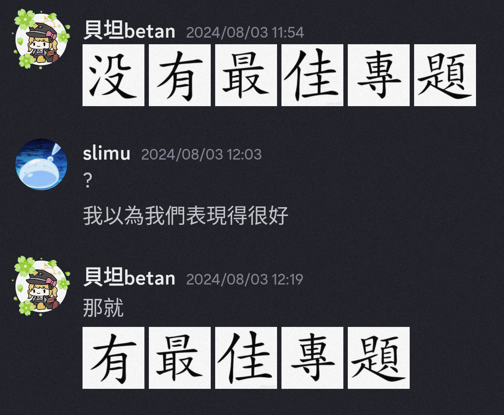


AIS3 a.k.a. 大型網友見面會  
好好玩 明年還去


## <h2>前言</h2>
這是我第一次參加AIS3 結果就不小心被我蹭到最佳專題獎了  
在這邊再次感謝小蔡、萊姆跟l3obo三位隊友的凱瑞

## <h2>專題</h2>
### 主題發想
我這次是選到情資運用及防護，組別為B8  
~~當初完全就是被這個看起來很酷的名子騙進來的，完全不知道這個在幹嘛~~
這也就導致我們專題主題想到了第二天才勉強定案，然後這邊要再跟我的組員道歉一次  
因為其實我一直想做有關惡意軟體的製作跟分析之類的，所以我算是有點堅持(?)的一直不放棄這個主題，~~結果最後也真的被我盧成功了~~  
最後的主題就是`基於聚類分析技術的惡意程式變體辨識方法研究`  
感謝勝舢助教協助主題發想🛐  
### 製作過程

我負責的部分算是進行資料的前處理以及資料的後續消化分析  
所以後面他們在做分析的時候我的工作內容就變成了問有沒有人要吃起司

### 報告
我們大概是最後一天下午才開始慢慢做簡報的，我只能跟大家說  
**完 全 做 不 完**  
因為其實我對做簡報也沒有到很熟，加上對主題也有點迷茫，因此其實改了很多次  
然後重要的一件事**一定要試報**，而且我是覺得需要不只一次  
其實我在真的試報以後才發現自己在時間的掌握、說話的結構上都還有很多很多的問題，所以後面就是開始瘋狂審稿加一直練習報自己的部分  
~~那個時候突然在想，我怎麼把報告報到跟在跑speedrun一樣 一直在瘋狂壓時間~~
這邊也謝謝三角蛇跟pwn2ooown兩位助教有聽我們試報  
但結果最後報告時間還是沒捏好，大概多講了40秒以上;\(  
我給自己報告的分數大概只有6/10  

## <h2>總結</h2>
我覺得AIS3其實滿適合像我這種，剛接觸有點概念了，但還是不太確定未來具體方向的人  
像我這種人來了AIS3就是兩個結果，一是確認自己未來方向；~~二是放棄資安~~  
~~本來是差點變成二了 但最佳專題獎讓我決定做資安這塊做到死了~~   
然後真的建議大家**要住宿**，晚上跟組員討論專題也是精華之一，~~我就有看到一組他們有組員沒住宿 我根本沒看過他們第四個組員~~ 
### 又卷
AIS3到底卷不卷，來這裡到底會不會爆肝？
卷，卷死了。拜託大家不要再卷了...  

### 累死
其實我覺得來AIS3會不會爆肝是要看個人欸  
看你追求什麼吧，如果目標是最佳專題的話當然是會很累  
但如果你只是想要來學習知識跟找到方向的話其實是可以不用那麼累的，但當然要跟自己專題的組員好好協調、溝通好  
~~不過都來了那目標當然是要放在最佳專題上吧~~
### 廢話時間
本來剛報告完是滿絕望的 我覺得自己講得很爛 而且時間也沒抓好
所以絕望之下就有了下面這張

~~結果最後還真的拿到了~~  
寫共筆真的很好玩，雖然感覺大家都只是把講師的報告打上去而已  
~~在下面註釋的地方聊天真的很好玩~~
