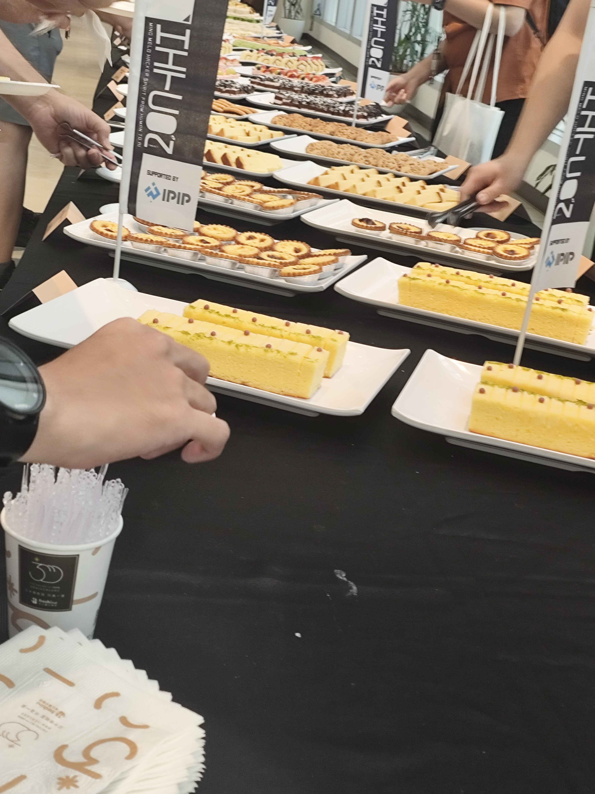
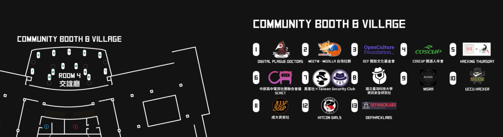


今年是我第一次參加HITCON，而我有幸能順利錄取學生免費方案，這邊再次感謝HITCON官方

## 感想
這邊先改一下順序，先講一下這次活動的感想，對於本活動有興趣的話可以再去閱讀下面的相關介紹  
這次的badge電路板、各種的攤位活動也都很有趣，議程也是有讓我了解了許多新東西，而且免費早餐跟點心也很都好吃👉👈

因為自己本身還是NISRA的幹部，因此其實這次主要是待在社群攤位，中間也有去聽了幾場自己感興趣的議程
這次活動讓我收穫許多，無論是badge的遊戲闖關、各種攤位活動、相關議程等，都讓我認識了許多全新的人，已經學習到了許多自己以前從未接觸過的方面  
我認為HITCON CMT是十分適合不論你是剛入門資安，又或是已經對於資安有一定的了解都可以來參加  

### 資安新手
對於剛入門的人來講，在這邊能夠去聽一些自己有興趣的議程，了解該方面的未來發展、相關技術等，又或是可以到處認識一堆大佬，結交一些新朋友，讓你在資安的道路上不孤獨，畢竟會來HITCON的人或多或少都是對於資安有興趣的人，建議大家不要害羞，可以勇敢一點去多跟不論是社群攤位的社團、贊助商攤位，又或是你想在路上隨機搭訕路人也不是不行 (X  
### 資安老手
而對於已經有一定程度的人來講，也能去多聽一些較為技術面向的議程，更重要的是如果平常有在打CTF的話，~~可以在現場看到一堆平常比賽時會遇到的賽棍~~  
也可以多去跟社群攤位聊一聊，或是參與他們的攤位活動，攤位的活動是比較技術取向的，也可以去激進自己的能力看看  
~~又或是要跟他們直接面試應該也不是不行~~

## HITCON
這邊先簡單介紹一下HITCON是甚麼 
HITCON aka 台灣駭客年會 Hacks In Taiwan Conference  
今年(2024)為HITCON舉辦的第20周年(啪機啪機啪機)  
而HITCON活動內容我認為主要可以分成下列三個部分  
分別是 議程、社群攤位、贊助商攤位  

## 社群攤位
社群攤位裡面主要是各校社團、資安相關社群等  
像是就有HITCON GIRLS、成大資安社(B33F 50UP戰隊)、中電會...　　
當然還有我所在的NISRA攤位 ~~雖然我也在B33F 50UP戰隊就是了~~  
其實滿建議大家沒事就可以多來這邊跟各大社群做交流，如果你還是高中生的話，可以前往中電會與他們稍作交流，而如果你是大學生也可以去到TSC的攤位去做一些了解之類的  
當然也很歡迎去其他各大攤位去了解他們在幹嘛，我自己是滿開心如果有人來我們攤位的啦，相信其他攤位基本上也都是這樣，因此也建議大家不要害羞，盡量去多多與大家交流，而且還可以拿很多攤位的酷酷獎品(X  

## 贊助商攤位
這邊主要是各大有贊助的廠商能夠來到這邊擺攤、介紹他們的公司，攤位也會有一些小活動，像是DEVCORE的套圈圈之類的。  
也能向各大攤位詢問一些他們公司的事項、或是你好奇的東西之類的  
其實基本上與社群攤位滿像的 只是變成是由公司擺攤

## 議程
這次去聽了很多場議程，而許多議程都不是用中文在講，但大家可以放心，現場都有開放同步口譯，因此也不用害怕自己聽不懂，反而還可以去接觸到平常很難有機會聽到的外文議程，也還可以多多訓練自己的外語聆聽能力(X  
但這邊主要介紹兩場印象比較深刻的議程，分別是`Evasive attacks against AI-powered antivirus software - Yu Arai` 、 `Background of those glitches in Zelda BoTW & ToTK - Yuda`

### Evasive attacks against AI-powered antivirus software - Yu Arai
這場議程主要是在介紹，他是如何bypass掉現在市面上現有的使用AI與傳統檢測技術的防毒軟體，以及最後也帶我們去思考了一下，會想繞過防毒是未來一定會面對到的議題，也因此該如何避免他們去繞過防毒也是一個很好也很重要的重點。  
而其實印象深刻的點主要有兩點，第一點是因為這場是日文的議程，本來以為自己可以不用靠翻譯就聽懂， ~~結果發現自己聽得懂的日文也就只有動漫那幾句~~  
而第二點其實是因為我今年AIS3專題做的部分也有點類似是在去靜態分析惡意軟體，因此發現自己做的類似的東西居然就這樣被bypass掉了，也有點震驚
### Background of those glitches in Zelda BoTW & ToTK - Yuda
這場是請到有在youtube拍攝影片的Yuda來做講師，而本場議程主要是在介紹說他們在遊戲中是如果去挖掘、發現一些獨特的漏洞(GLITCH)，以及一些相關經驗分享等  
我認為這是一場很特別很酷的議程，他並非像是傳統常見的議程，他反而沒有特別介紹許多技術相關的內容，但是我覺得其中挖掘漏洞所需要的思考及創新結合，是資安人會滿需要具備的能力，就是能跳脫傳統思考的樣子，總之是場很棒的議程  